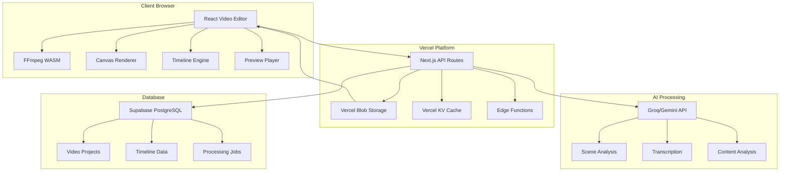

# Architecture: Video Processing Pipeline

## Overview
Define the complete video processing architecture for Project Chimera, leveraging modern web technologies and cloud services to deliver professional-grade video editing capabilities in the browser.

## Architecture Principles

Following the **Supercharger Manifesto v3.0**:
1. **Specification First**: All components defined before implementation
2. **Streaming First**: Real-time processing feedback and preview
3. **Free Tier Only**: Vercel ecosystem with cost-effective solutions
4. **Test Everything**: Comprehensive testing at all layers
5. **Production First**: Scalable, monitored, and reliable

## System Architecture



## Processing Pipeline Stages

### Stage 1: Upload & Ingestion
```typescript
// src/lib/video/upload-pipeline.ts
export class UploadPipeline {
  async initializeUpload(file: File, metadata: VideoMetadata): Promise<UploadSession> {
    // 1. Validate file format and size
    const validation = await this.validateVideoFile(file);
    if (!validation.valid) {
      throw new Error(`Invalid file: ${validation.errors.join(', ')}`);
    }
    
    // 2. Create upload session in Supabase
    const session = await this.createUploadSession({
      fileName: file.name,
      fileSize: file.size,
      mimeType: file.type,
      ...metadata
    });
    
    // 3. Generate presigned URL for Vercel Blob
    const blobUrl = await put(`videos/${session.id}/${file.name}`, file, {
      access: 'private',
      handleUploadUrl: '/api/v2/video/upload/handle'
    });
    
    return {
      id: session.id,
      uploadUrl: blobUrl.url,
      chunkSize: CHUNK_SIZE,
      expiresAt: new Date(Date.now() + 24 * 60 * 60 * 1000) // 24 hours
    };
  }
  
  async processUploadedVideo(sessionId: string): Promise<void> {
    const session = await this.getUploadSession(sessionId);
    
    // Start async processing pipeline
    await this.queueProcessingJob({
      type: 'video_processing',
      sessionId,
      stages: ['metadata_extraction', 'transcoding', 'analysis']
    });
  }
}
```

### Stage 2: Metadata Extraction & Validation
```typescript
// src/lib/video/metadata-extractor.ts
export class MetadataExtractor {
  async extractVideoMetadata(videoUrl: string): Promise<VideoMetadata> {
    // Use FFmpeg to extract comprehensive metadata
    const ffmpeg = new FFmpeg();
    await ffmpeg.load();
    
    await ffmpeg.writeFile('input.mp4', await fetchFile(videoUrl));
    
    // Extract metadata using ffprobe
    await ffmpeg.exec([
      '-i', 'input.mp4',
      '-show_format',
      '-show_streams',
      '-v', 'quiet',
      '-print_format', 'json',
      'metadata.json'
    ]);
    
    const metadataBuffer = await ffmpeg.readFile('metadata.json');
    const metadata = JSON.parse(Buffer.from(metadataBuffer).toString());
    
    return {
      duration: parseFloat(metadata.format.duration),
      width: metadata.streams[0].width,
      height: metadata.streams[0].height,
      frameRate: eval(metadata.streams[0].avg_frame_rate),
      bitRate: parseInt(metadata.format.bit_rate),
      codec: metadata.streams[0].codec_name,
      audioStreams: metadata.streams.filter(s => s.codec_type === 'audio').length,
      hasVideo: metadata.streams.some(s => s.codec_type === 'video'),
      hasAudio: metadata.streams.some(s => s.codec_type === 'audio')
    };
  }
}
```

### Stage 3: Transcoding & Optimization
```typescript
// src/lib/video/transcoding-engine.ts
export class TranscodingEngine {
  async generateProxyVersions(
    sourceUrl: string,
    resolutions: ('480p' | '720p' | '1080p' | '4K')[]
  ): Promise<TranscodingResult[]> {
    const results: TranscodingResult[] = [];
    
    for (const resolution of resolutions) {
      const config = this.getResolutionConfig(resolution);
      
      const outputUrl = await this.transcodeVideo({
        input: sourceUrl,
        output: {
          format: 'mp4',
          codec: 'h264',
          ...config
        }
      });
      
      results.push({
        resolution,
        url: outputUrl,
        fileSize: await this.getFileSize(outputUrl),
        bitRate: config.bitRate
      });
    }
    
    return results;
  }
  
  private getResolutionConfig(resolution: string) {
    const configs = {
      '480p': { width: 854, height: 480, bitRate: 1000 },
      '720p': { width: 1280, height: 720, bitRate: 2500 },
      '1080p': { width: 1920, height: 1080, bitRate: 5000 },
      '4K': { width: 3840, height: 2160, bitRate: 15000 }
    };
    return configs[resolution];
  }
}
```

### Stage 4: AI Analysis Integration
```typescript
// src/lib/video/ai-analysis-pipeline.ts
export class AIAnalysisPipeline {
  constructor(
    private aiProvider: AIProvider,
    private transcriptionService: TranscriptionService
  ) {}
  
  async analyzeVideo(videoUrl: string, options: AnalysisOptions): Promise<VideoAnalysis> {
    const analysis: Partial<VideoAnalysis> = {};
    
    // 1. Extract audio and transcribe
    if (options.transcription) {
      const audioUrl = await this.extractAudio(videoUrl);
      analysis.transcription = await this.transcriptionService.transcribe(audioUrl);
    }
    
    // 2. Scene detection
    if (options.sceneDetection) {
      analysis.scenes = await this.detectScenes(videoUrl);
    }
    
    // 3. Content analysis
    if (options.contentAnalysis) {
      const keyframes = await this.extractKeyframes(videoUrl, 10); // 10 keyframes
      analysis.contentAnalysis = await this.aiProvider.analyzeImages(keyframes);
    }
    
    // 4. Audio analysis
    if (options.audioAnalysis) {
      analysis.audioAnalysis = await this.analyzeAudio(videoUrl);
    }
    
    return analysis as VideoAnalysis;
  }
  
  private async detectScenes(videoUrl: string): Promise<Scene[]> {
    const ffmpeg = new FFmpeg();
    await ffmpeg.load();
    
    // Use FFmpeg scene detection
    await ffmpeg.exec([
      '-i', videoUrl,
      '-filter:v', 'select=gt(scene\\,0.3)',
      '-f', 'null',
      '-'
    ]);
    
    // Parse scene detection output and return structured data
    // Implementation would parse FFmpeg output to identify scene boundaries
    return [];
  }
}
```

## Storage Architecture

### Vercel Blob Storage Organization
```typescript
// Storage structure for video assets
const STORAGE_STRUCTURE = {
  videos: {
    originals: 'videos/original/{projectId}/{filename}',
    proxies: {
      '480p': 'videos/proxy/480p/{projectId}/{filename}',
      '720p': 'videos/proxy/720p/{projectId}/{filename}',
      '1080p': 'videos/proxy/1080p/{projectId}/{filename}',
      '4K': 'videos/proxy/4k/{projectId}/{filename}'
    },
    thumbnails: 'videos/thumbnails/{projectId}/{timestamp}.jpg',
    audio: 'videos/audio/{projectId}/{filename}.mp3',
    exports: 'videos/exports/{projectId}/{exportId}/{filename}'
  },
  cache: {
    keyframes: 'cache/keyframes/{videoId}/',
    waveforms: 'cache/waveforms/{videoId}.json',
    analysis: 'cache/analysis/{videoId}/'
  }
};

export class VideoStorageManager {
  async storeVideo(file: File, projectId: string): Promise<VideoStorageResult> {
    const originalUrl = await put(
      STORAGE_STRUCTURE.videos.originals
        .replace('{projectId}', projectId)
        .replace('{filename}', file.name),
      file,
      { access: 'private' }
    );
    
    return {
      originalUrl: originalUrl.url,
      projectId,
      filename: file.name,
      size: file.size
    };
  }
  
  async getVideoUrl(projectId: string, quality?: string): Promise<string> {
    if (quality && quality !== 'original') {
      const path = STORAGE_STRUCTURE.videos.proxies[quality]
        .replace('{projectId}', projectId);
      return await this.getSignedUrl(path);
    }
    
    const path = STORAGE_STRUCTURE.videos.originals
      .replace('{projectId}', projectId);
    return await this.getSignedUrl(path);
  }
}
```

### Caching Strategy with Vercel KV
```typescript
// src/lib/video/caching-strategy.ts
export class VideoCacheManager {
  constructor(private kv = kv) {}
  
  async cacheAnalysisResult(videoId: string, analysis: VideoAnalysis): Promise<void> {
    const key = `analysis:${videoId}`;
    await this.kv.set(key, JSON.stringify(analysis), { ex: 86400 }); // 24 hours
  }
  
  async getCachedAnalysis(videoId: string): Promise<VideoAnalysis | null> {
    const key = `analysis:${videoId}`;
    const cached = await this.kv.get(key);
    return cached ? JSON.parse(cached as string) : null;
  }
  
  async cacheProcessingStatus(jobId: string, status: ProcessingStatus): Promise<void> {
    const key = `processing:${jobId}`;
    await this.kv.set(key, JSON.stringify(status), { ex: 3600 }); // 1 hour
  }
  
  async invalidateVideoCache(videoId: string): Promise<void> {
    const patterns = [
      `analysis:${videoId}`,
      `processing:${videoId}:*`,
      `keyframes:${videoId}`,
      `waveform:${videoId}`
    ];
    
    for (const pattern of patterns) {
      await this.kv.del(pattern);
    }
  }
}
```

## Processing Job Queue

### Background Processing System
```typescript
// src/lib/video/job-queue.ts
export class VideoProcessingQueue {
  constructor(
    private db: Database,
    private storageManager: VideoStorageManager,
    private analysisEngine: AIAnalysisPipeline
  ) {}
  
  async queueJob(job: ProcessingJob): Promise<string> {
    const jobId = generateId();
    
    // Store job in database
    await this.db.processingJobs.create({
      id: jobId,
      projectId: job.projectId,
      type: job.type,
      status: 'queued',
      inputData: job.inputData,
      priority: job.priority || 0
    });
    
    // Trigger processing in Edge Function
    await fetch('/api/v2/video/process', {
      method: 'POST',
      body: JSON.stringify({ jobId })
    });
    
    return jobId;
  }
  
  async processJob(jobId: string): Promise<void> {
    const job = await this.db.processingJobs.findUnique({
      where: { id: jobId }
    });
    
    if (!job) throw new Error(`Job ${jobId} not found`);
    
    try {
      await this.updateJobStatus(jobId, 'processing');
      
      const result = await this.executeJob(job);
      
      await this.updateJobStatus(jobId, 'completed', result);
    } catch (error) {
      await this.updateJobStatus(jobId, 'failed', null, error.message);
    }
  }
  
  private async executeJob(job: ProcessingJob): Promise<any> {
    switch (job.type) {
      case 'video_analysis':
        return await this.analysisEngine.analyzeVideo(
          job.inputData.videoUrl,
          job.inputData.options
        );
        
      case 'video_transcoding':
        return await this.transcodingEngine.generateProxyVersions(
          job.inputData.videoUrl,
          job.inputData.resolutions
        );
        
      case 'export_video':
        return await this.exportEngine.exportTimeline(
          job.inputData.timeline,
          job.inputData.options
        );
        
      default:
        throw new Error(`Unknown job type: ${job.type}`);
    }
  }
}
```

## Real-time Processing Updates

### Server-Sent Events for Progress Tracking
```typescript
// app/api/v2/video/processing-status/[jobId]/route.ts
export async function GET(
  request: NextRequest,
  { params }: { params: { jobId: string } }
) {
  const jobId = params.jobId;
  
  const stream = new ReadableStream({
    async start(controller) {
      const sendUpdate = (data: any) => {
        controller.enqueue(`data: ${JSON.stringify(data)}\n\n`);
      };
      
      // Send initial status
      const job = await db.processingJobs.findUnique({
        where: { id: jobId }
      });
      
      sendUpdate({
        type: 'status',
        jobId,
        status: job?.status,
        progress: 0
      });
      
      // Set up real-time updates
      const interval = setInterval(async () => {
        const updatedJob = await db.processingJobs.findUnique({
          where: { id: jobId }
        });
        
        if (updatedJob?.status === 'completed' || updatedJob?.status === 'failed') {
          sendUpdate({
            type: 'complete',
            jobId,
            status: updatedJob.status,
            result: updatedJob.outputData
          });
          
          clearInterval(interval);
          controller.close();
          return;
        }
        
        sendUpdate({
          type: 'progress',
          jobId,
          status: updatedJob?.status,
          progress: updatedJob?.progress || 0
        });
      }, 1000);
      
      // Cleanup on client disconnect
      request.signal.addEventListener('abort', () => {
        clearInterval(interval);
        controller.close();
      });
    }
  });
  
  return new Response(stream, {
    headers: {
      'Content-Type': 'text/event-stream',
      'Cache-Control': 'no-cache',
      'Connection': 'keep-alive'
    }
  });
}
```

## Performance Optimization

### Browser-Side Processing Optimization
```typescript
// src/lib/video/performance-optimizer.ts
export class VideoPerformanceOptimizer {
  private workerPool: Worker[] = [];
  private ffmpegInstances: Map<string, FFmpeg> = new Map();
  
  constructor() {
    // Initialize worker pool for CPU-intensive tasks
    this.initializeWorkerPool();
  }
  
  async optimizeForBrowser(videoUrl: string): Promise<OptimizedVideo> {
    // 1. Check if browser can handle the video format
    const canPlay = await this.checkBrowserSupport(videoUrl);
    
    if (!canPlay) {
      // Convert to browser-compatible format
      return await this.convertToBrowserFormat(videoUrl);
    }
    
    // 2. Generate optimized versions for different use cases
    const versions = await Promise.all([
      this.generatePreviewVersion(videoUrl), // Low quality for scrubbing
      this.generateEditingProxy(videoUrl),   // Medium quality for editing
      this.generateThumbnailStrip(videoUrl)  // Thumbnail previews
    ]);
    
    return {
      original: videoUrl,
      preview: versions[0],
      proxy: versions[1],
      thumbnails: versions[2]
    };
  }
  
  private async generateEditingProxy(videoUrl: string): Promise<string> {
    // Create a lightweight proxy for smooth editing
    const ffmpeg = await this.getFFmpegInstance('proxy');
    
    await ffmpeg.writeFile('input.mp4', await fetchFile(videoUrl));
    
    await ffmpeg.exec([
      '-i', 'input.mp4',
      '-vf', 'scale=854:480', // 480p resolution
      '-c:v', 'libx264',
      '-preset', 'fast',
      '-crf', '28', // Higher compression for proxy
      '-c:a', 'aac',
      'proxy.mp4'
    ]);
    
    const proxyBuffer = await ffmpeg.readFile('proxy.mp4');
    return URL.createObjectURL(new Blob([proxyBuffer], { type: 'video/mp4' }));
  }
}
```

### Memory Management
```typescript
// src/lib/video/memory-manager.ts
export class VideoMemoryManager {
  private memoryUsage: Map<string, number> = new Map();
  private readonly MAX_MEMORY = 2 * 1024 * 1024 * 1024; // 2GB limit
  
  async allocateForVideo(videoId: string, estimatedSize: number): Promise<boolean> {
    const currentUsage = this.getCurrentMemoryUsage();
    
    if (currentUsage + estimatedSize > this.MAX_MEMORY) {
      // Cleanup least recently used videos
      await this.cleanupLRU(estimatedSize);
    }
    
    this.memoryUsage.set(videoId, estimatedSize);
    return true;
  }
  
  async cleanupVideo(videoId: string): Promise<void> {
    // Revoke object URLs
    const video = document.querySelector(`video[data-id="${videoId}"]`) as HTMLVideoElement;
    if (video?.src.startsWith('blob:')) {
      URL.revokeObjectURL(video.src);
    }
    
    // Clear from cache
    await caches.delete(`video-${videoId}`);
    
    this.memoryUsage.delete(videoId);
  }
  
  private getCurrentMemoryUsage(): number {
    return Array.from(this.memoryUsage.values()).reduce((sum, size) => sum + size, 0);
  }
}
```

## Monitoring & Observability

### Processing Pipeline Metrics
```typescript
// src/lib/video/monitoring.ts
export class VideoProcessingMetrics {
  async recordProcessingTime(jobType: string, duration: number): Promise<void> {
    await fetch('/api/v2/metrics', {
      method: 'POST',
      body: JSON.stringify({
        metric: 'processing_time',
        value: duration,
        tags: { jobType }
      })
    });
  }
  
  async recordUploadSpeed(fileSize: number, uploadTime: number): Promise<void> {
    const speedMbps = (fileSize / (1024 * 1024)) / (uploadTime / 1000);
    
    await fetch('/api/v2/metrics', {
      method: 'POST',
      body: JSON.stringify({
        metric: 'upload_speed',
        value: speedMbps,
        tags: { fileSize: this.categorizeFileSize(fileSize) }
      })
    });
  }
  
  async recordError(operation: string, error: Error): Promise<void> {
    await fetch('/api/v2/metrics', {
      method: 'POST',
      body: JSON.stringify({
        metric: 'error',
        value: 1,
        tags: { operation, errorType: error.constructor.name }
      })
    });
  }
}
```

## Security & Access Control

### Video Access Security
```typescript
// src/lib/video/security.ts
export class VideoSecurityManager {
  async generateSignedUrl(
    videoPath: string,
    userId: string,
    expirationHours: number = 24
  ): Promise<string> {
    // Verify user has access to this video
    const hasAccess = await this.verifyVideoAccess(videoPath, userId);
    if (!hasAccess) {
      throw new Error('Unauthorized access to video');
    }
    
    // Generate time-limited signed URL
    const expirationTime = Date.now() + (expirationHours * 60 * 60 * 1000);
    const signature = await this.signUrl(videoPath, expirationTime);
    
    return `${videoPath}?expires=${expirationTime}&signature=${signature}`;
  }
  
  async validateVideoContent(videoUrl: string): Promise<ContentValidationResult> {
    // Use AI for content moderation
    const analysis = await this.aiProvider.analyzeContent(videoUrl, {
      checkForInappropriateContent: true,
      checkForCopyright: true,
      checkForPrivacyViolations: true
    });
    
    return {
      isAppropriate: analysis.appropriatenessScore > 0.8,
      containsCopyright: analysis.copyrightDetected,
      privacyIssues: analysis.privacyViolations,
      confidence: analysis.confidence
    };
  }
}
```

## Deployment Configuration

### Vercel Configuration
```json
{
  "functions": {
    "app/api/v2/video/process/route.ts": {
      "maxDuration": 300
    },
    "app/api/v2/video/upload/*/route.ts": {
      "maxDuration": 60
    }
  },
  "crons": [
    {
      "path": "/api/v2/video/cleanup",
      "schedule": "0 2 * * *"
    }
  ]
}
```

### Environment Configuration
```env
# Video processing configuration
MAX_VIDEO_SIZE_GB=5
MAX_PROCESSING_DURATION_MINUTES=30
ENABLE_4K_PROCESSING=true
DEFAULT_EXPORT_QUALITY=1080p

# Storage configuration
VERCEL_BLOB_READ_WRITE_TOKEN=xxx
VIDEO_RETENTION_DAYS=365
CACHE_RETENTION_HOURS=24

# AI configuration
ENABLE_CONTENT_MODERATION=true
TRANSCRIPTION_PROVIDER=groq
SCENE_DETECTION_THRESHOLD=0.3
```

## Success Metrics

### Performance Targets
- **Upload Speed**: > 10 MB/s for good connections
- **Processing Time**: < 2x video duration for standard analysis
- **Preview Generation**: < 30 seconds for any video
- **Export Time**: < 1.5x video duration for standard export
- **Memory Usage**: < 4GB peak usage for 4K editing
- **Error Rate**: < 1% for all operations

### Reliability Targets
- **Uptime**: 99.9%
- **Data Durability**: 99.99%
- **Processing Success Rate**: > 99%
- **Upload Success Rate**: > 99.5%
- **Recovery Time**: < 5 minutes for any failures