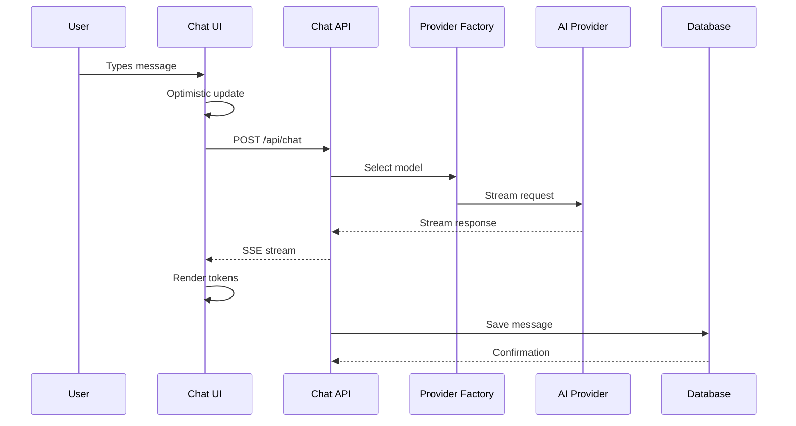
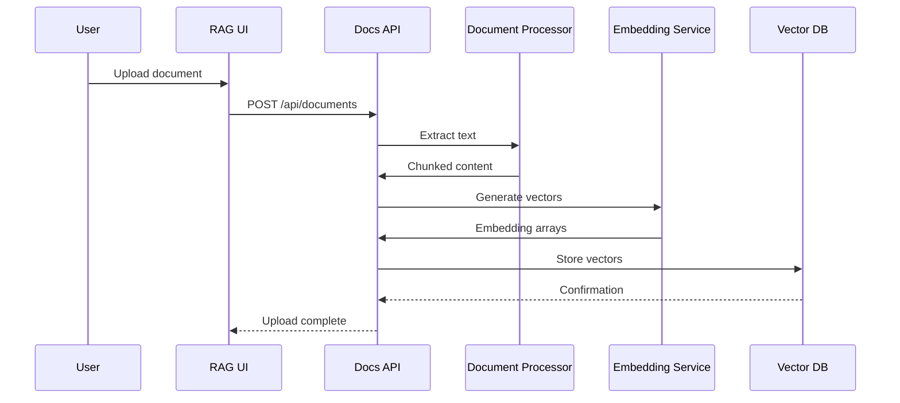
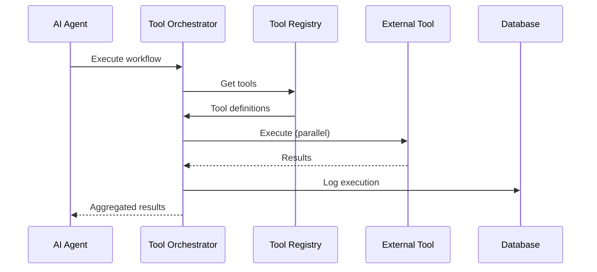

# Architecture Overview Specification

## Overview
Project Chimera follows the **Supercharger Manifesto v3.0** architecture principles with a Next.js 15 App Router frontend, Vercel Edge Functions for API endpoints, and Supabase for data persistence with pgvector for RAG capabilities.

## Core Principles

### 1. Specification First
- All features begin with detailed specifications in `specs/features/`
- Implementation follows specifications exactly
- GitHub Copilot references specs for code generation
- Specifications serve as single source of truth

### 2. Streaming First
- All AI interactions use `streamText` from Vercel AI SDK
- No blocking AI calls in user-facing features
- Real-time UI updates during AI responses
- Progressive enhancement for better UX

### 3. Free Tier Only
- **Groq**: Primary AI provider (30 req/min free)
- **Google Gemini**: Fallback provider (60 req/min free)  
- **Supabase**: Database and auth (500MB free)
- **Vercel**: Hosting and edge functions (free tier)

### 4. Test Everything
- Test-Driven Development (TDD) required
- Unit tests for all business logic
- Integration tests for API endpoints
- E2E tests for critical user journeys

### 5. Production First
- Every feature is production-ready from day one
- Vercel deployment pipeline integrated
- Environment configuration for multiple stages
- Monitoring and error tracking built-in

## System Architecture

### High-Level Architecture
```
┌─────────────────┐    ┌─────────────────┐    ┌─────────────────┐
│   Frontend      │    │   Backend       │    │   External      │
│   (Next.js 15)  │    │   (Vercel)      │    │   Services      │
│                 │    │                 │    │                 │
│ ┌─────────────┐ │    │ ┌─────────────┐ │    │ ┌─────────────┐ │
│ │ Chat UI     │ │◄──►│ │ Chat API    │ │◄──►│ │ Groq API    │ │
│ │ Streaming   │ │    │ │ /api/chat   │ │    │ │ Gemini API  │ │
│ └─────────────┘ │    │ └─────────────┘ │    │ └─────────────┘ │
│                 │    │                 │    │                 │
│ ┌─────────────┐ │    │ ┌─────────────┐ │    │ ┌─────────────┐ │
│ │ RAG UI      │ │◄──►│ │ Documents   │ │◄──►│ │ Supabase    │ │
│ │ Components  │ │    │ │ /api/docs   │ │    │ │ Database    │ │
│ └─────────────┘ │    │ └─────────────┘ │    │ └─────────────┘ │
│                 │    │                 │    │                 │
│ ┌─────────────┐ │    │ ┌─────────────┐ │    │ ┌─────────────┐ │
│ │ Tool UI     │ │◄──►│ │ Tools API   │ │◄──►│ │ External    │ │
│ │ Orchestrate │ │    │ │ /api/tools  │ │    │ │ APIs        │ │
│ └─────────────┘ │    │ └─────────────┘ │    │ └─────────────┘ │
└─────────────────┘    └─────────────────┘    └─────────────────┘
```

### Technology Stack

#### Frontend Layer
- **Framework**: Next.js 15 with App Router
- **UI Library**: Custom components with Tailwind CSS 4.0
- **State Management**: Zustand for client state
- **Streaming**: Vercel AI SDK React hooks
- **Animations**: Framer Motion for smooth transitions

#### API Layer
- **Runtime**: Vercel Edge Functions
- **AI Integration**: Vercel AI SDK with multi-provider support
- **Authentication**: NextAuth.js with Supabase adapter
- **Validation**: Zod for request/response schemas

#### Data Layer
- **Database**: Supabase PostgreSQL
- **ORM**: Drizzle ORM with type safety
- **Vector Search**: pgvector extension for RAG
- **Real-time**: Supabase real-time subscriptions

## Directory Structure

```
Project-Chimera/
├── frontend/                    # Next.js 15 application
│   ├── src/
│   │   ├── app/                # App Router pages and layouts
│   │   │   ├── (chat)/         # Chat interface routes
│   │   │   ├── api/            # API route handlers
│   │   │   │   ├── chat/       # Chat streaming endpoints
│   │   │   │   ├── documents/  # RAG document management
│   │   │   │   └── tools/      # Tool orchestration APIs
│   │   │   └── globals.css     # Global styles
│   │   ├── components/         # Reusable UI components
│   │   │   ├── ui/             # Base UI components
│   │   │   ├── chat/           # Chat-specific components
│   │   │   ├── rag/            # RAG interface components
│   │   │   └── tools/          # Tool UI components
│   │   └── lib/                # Core utilities and services
│   │       ├── ai/             # AI provider integrations
│   │       │   ├── provider-factory.ts
│   │       │   ├── chimera-types.ts
│   │       │   └── streaming.ts
│   │       ├── db/             # Database utilities
│   │       │   ├── schema.ts   # Drizzle schema
│   │       │   ├── client.ts   # Database client
│   │       │   └── migrations/ # Database migrations
│   │       ├── rag/            # RAG pipeline components
│   │       │   ├── embeddings.ts
│   │       │   ├── retrieval.ts
│   │       │   └── processing.ts
│   │       └── tools/          # Tool orchestration
│   │           ├── registry.ts
│   │           ├── executor.ts
│   │           └── built-in/
│   ├── public/                 # Static assets
│   ├── package.json           # Dependencies and scripts
│   └── next.config.ts         # Next.js configuration
├── specs/                     # Feature specifications
│   ├── features/              # Individual feature specs
│   │   ├── ai-chat.spec.md
│   │   ├── generative-ui.spec.md
│   │   ├── tool-orchestration.spec.md
│   │   ├── rag-pipeline.spec.md
│   │   └── api-endpoints.spec.md
│   └── README.md              # Specifications overview
├── .github/                   # GitHub configuration
│   ├── copilot-instructions.md
│   ├── instructions/
│   │   └── AGENT_INSTRUCTIONS.md
│   ├── prompts/               # AI prompt templates
│   └── workflows/             # GitHub Actions
└── README.md                  # Project documentation
```

## Core Components

### AI Provider Factory
```typescript
// src/lib/ai/provider-factory.ts
interface ProviderFactory {
  selectModel(criteria: ModelSelectionCriteria): Promise<LanguageModel>;
  getCapabilities(provider: string): ProviderCapabilities;
  checkHealth(provider: string): Promise<HealthStatus>;
  handleFallback(error: ProviderError): Promise<LanguageModel>;
}

interface ModelSelectionCriteria {
  complexity: 'simple' | 'moderate' | 'complex';
  capabilities: string[];
  latencyRequirement: number;
  costConstraint: 'free' | 'low' | 'medium';
}
```

### Streaming Interface
```typescript
// src/components/chat/streaming-interface.tsx
interface StreamingInterfaceProps {
  conversationId?: string;
  initialMessages?: Message[];
  onNewConversation?: (id: string) => void;
  tools?: ToolDefinition[];
}

export function StreamingInterface(props: StreamingInterfaceProps) {
  const { messages, input, handleInputChange, handleSubmit } = useChat({
    api: '/api/chat',
    initialMessages: props.initialMessages,
    onFinish: (message) => {
      // Handle message completion
    }
  });
  
  // Progressive rendering of messages
  // Tool integration and execution
  // Error boundaries and fallbacks
}
```

### Database Schema
```typescript
// src/lib/db/schema.ts
export const conversations = pgTable('conversations', {
  id: text('id').primaryKey(),
  userId: text('user_id').notNull(),
  title: text('title').notNull(),
  createdAt: timestamp('created_at').defaultNow(),
  updatedAt: timestamp('updated_at').defaultNow()
});

export const messages = pgTable('messages', {
  id: text('id').primaryKey(),
  conversationId: text('conversation_id').references(() => conversations.id),
  role: text('role').$type<'user' | 'assistant' | 'system'>().notNull(),
  content: text('content').notNull(),
  metadata: jsonb('metadata'),
  createdAt: timestamp('created_at').defaultNow()
});
```

## Data Flow Patterns

### Chat Message Flow


### RAG Pipeline Flow


### Tool Orchestration Flow


## Performance Characteristics

### Response Time Targets
- **Chat API**: < 100ms TTFB, < 500ms token streaming
- **Document Processing**: < 500ms per document
- **Vector Search**: < 200ms for semantic queries
- **Tool Execution**: < 5s per individual tool
- **UI Rendering**: < 200ms component updates

### Scalability Limits
- **Concurrent Users**: 1,000+ simultaneous
- **Documents**: 10,000+ in vector database
- **Messages**: 1M+ conversation history
- **Tools**: 100+ registered tools
- **API Requests**: Within provider free tier limits

### Resource Utilization
- **Memory**: < 512MB baseline, < 1GB peak
- **CPU**: Optimized for V8 engine efficiency
- **Storage**: Efficient text compression and chunking
- **Bandwidth**: Minimal payload sizes with streaming

## Security Architecture

### Authentication & Authorization
- **User Auth**: NextAuth.js with multiple providers
- **API Security**: JWT tokens for API routes
- **Database**: Row-level security (RLS) in Supabase
- **Permissions**: Granular permissions for tools and documents

### Data Protection
- **Encryption**: TLS in transit, encrypted at rest
- **Sanitization**: Input validation on all endpoints
- **Isolation**: User data completely isolated
- **Audit**: Complete audit trail for sensitive operations

### API Security
- **Rate Limiting**: Per-user and per-IP limits
- **CORS**: Strict origin validation
- **Headers**: Security headers for XSS/CSRF protection
- **Validation**: Zod schemas for all requests

## Monitoring & Observability

### Application Metrics
- **Performance**: Response times and throughput
- **Errors**: Error rates and failure patterns
- **Usage**: Feature adoption and user behavior
- **Costs**: AI provider usage and costs

### Infrastructure Metrics
- **Vercel**: Function execution and cold starts
- **Supabase**: Database performance and connections
- **AI Providers**: API quotas and rate limits
- **CDN**: Cache hit rates and bandwidth

### Alerting Strategy
- **Critical**: System outages and data corruption
- **Warning**: Performance degradation and quota limits
- **Info**: Feature usage and optimization opportunities

## Deployment Architecture

### Environment Strategy
```bash
# Development
NEXT_PUBLIC_SUPABASE_URL=dev-instance
GROQ_API_KEY=dev-key

# Staging  
NEXT_PUBLIC_SUPABASE_URL=staging-instance
GROQ_API_KEY=staging-key

# Production
NEXT_PUBLIC_SUPABASE_URL=prod-instance
GROQ_API_KEY=prod-key
```

### Deployment Pipeline
1. **Feature Branch**: Development and initial testing
2. **Staging**: Integration testing and QA validation
3. **Production**: Automated deployment with monitoring

### Rollback Strategy
- **Immediate**: Vercel instant rollback capability
- **Database**: Migration rollback procedures
- **Feature Flags**: Gradual feature enabling/disabling

## Development Workflow

### Daily Development Process
1. **Morning**: Review specifications for current feature
2. **Implementation**: Let GitHub Copilot reference specs
3. **Testing**: Run tests frequently during development
4. **Integration**: Push to feature branch for CI/CD
5. **Review**: Automated and manual code review
6. **Deploy**: Merge triggers production deployment

### Code Quality Standards
- **TypeScript**: Strict mode with comprehensive types
- **ESLint**: Enforced coding standards
- **Prettier**: Consistent code formatting
- **Testing**: Minimum 80% code coverage
- **Documentation**: Self-documenting code with JSDoc

### GitHub Copilot Integration
- **Specifications**: Copilot references specs/ directory
- **Prompts**: Standardized prompts in .github/prompts/
- **Templates**: Code generation templates
- **Context**: Workspace configuration for better suggestions